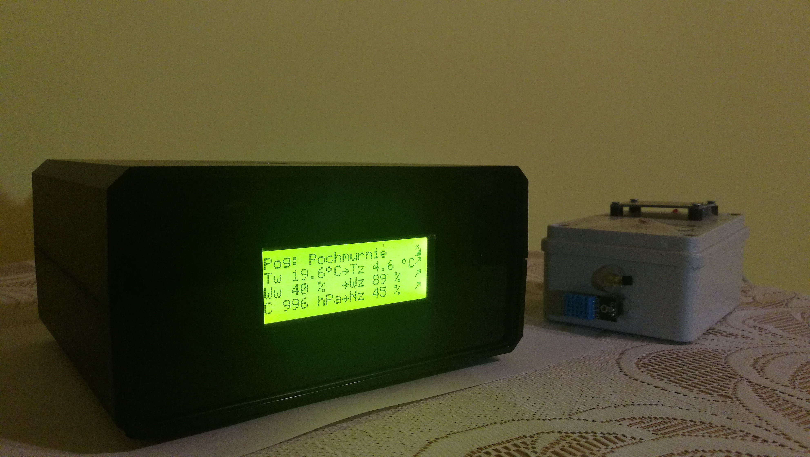
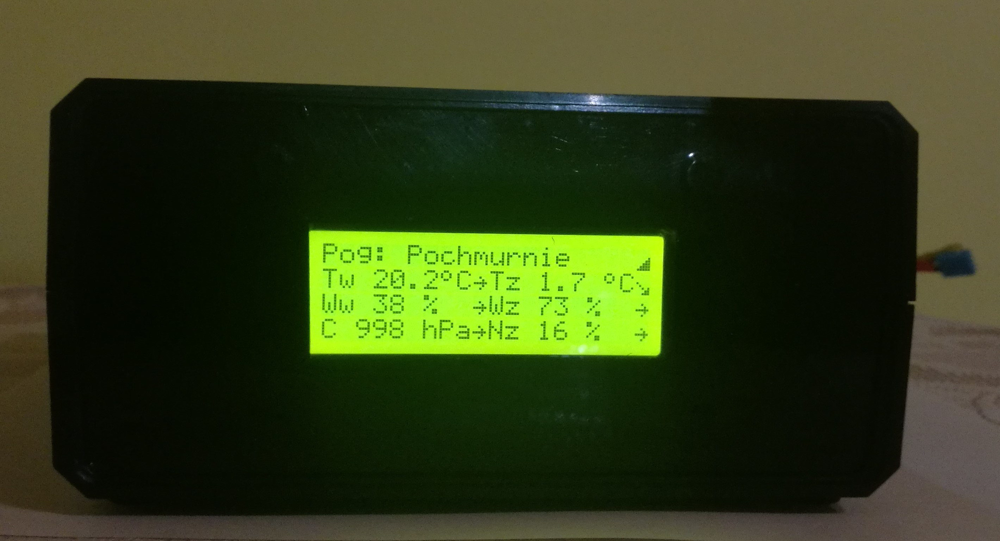

# WeatheReport

WeatheReport is a remote meteorological station that retrieves weather information 
from a nearby environment, displays specific information on the mounted LCD screen 
and connects to the Internet by sending data to the database, 
which are then displayed on the website in the form of numerical data and charts.

## Table of contents
* [General info](#general-info)
* [Screenshots](#screenshots)
* [Technologies](#technologies)
* [Libraries](#libraries)
* [Components](#components)
* [Setup](#setup)
* [Features](#features)
* [Status](#status)
* [Inspiration](#inspiration)
* [Contact](#contact)

## General info
The device is designed for home users to provide them with the right information 
about the weather in their immediate surroundings. 
The data posted on the website allow to compare them with previously measured ones.

The following parameters are recorded: temperature, humidity and atmospheric pressure 
inside the room where the weather station will be located, as well as data sent from 
the radio transmitter: temperature, humidity, insolation, current weather. 
The transmitter is designed for recording data from the outside.
Project based on the Arduino modules.

## Screenshots
WeatheReport station

Weather station reciever

Transmitter

## Technologies
* Arduino IDE - version 1.8.7
* XAMPP - version 3.2.2
* MySQL - version 5.7
* phpMyAdmin - version 4.8.4

## Libraries
* "WeatheReport_lib.h" - version 1.6.0 
* "DHT.h" - version 1.3.1
* "DallasTemperature.h" - version 3.8.0
* "i2c_BMP280.h" - version 0.8.2
* "LiquidCrystal_I2C.h"
* "OneWire.h" - version 2.3.4
* "RF24.h" - version 1.0.0
* "Ethernet.h" - version 2.0.0
* "SPI.h" - version 1.2.3

## Components
* Arduino UNO 
* Arduino Nano
* lcd screen 4x20 + I2C converter
* ethernet module: Ethernet shield W5100
* pressure sensor GY-BMP280 V3.3
* water sensor FC-37
* radio module 2.4GHz nRF24L01 x 2
* temperature sensor DS18B20  x 2
* humidity sensor DHT11  x 2
* photoresistor GL5616
* resistor 4,7kΩ  x 4
* resitor 6,6kΩ
* resistor 330Ω
* DB9 socket
* led diode

## Setup
Download and install XAMPP program. On the XAMPP Control Panel start Apache and MySQL module.
In the web browser write and click on the sql:
'http://localhost/phpmyadmin/'

Click on the "SQL" button, copy and paste content,
from the create_table.sql file or export this file to phpMyAdmin. 
In the XAMPP folder on the disk, search '/xampp/htdocs' and paste '/website/xampp/htdocs/ethernet' folder.
To get to the website with data write in browser 
'http://localhost:80/ethernet/index.php' 
 
Download and install the Arduino IDE. Copy '/Arduino/libraries' files to the folder with installed Arduino IDE on the disk.  
Load the '/schemas/WR_WeatherStation/WR_WeatherStation.ino' file into the Arduino IDE. Add libraries to the project.
In 'tools' change board on 'Arduino/Genuino Uno'. 
In code file change iPv4 server device address on the own IP device address, where the XAMPP was installed.
Mount the device according to the schema 'WR_station_schema.jpg' and connect to the computer by USB. 
Change port COM to the actual connected.Then click on verify and load the program. Next load the '/WR_WeatherStation/Transmitter.ino' to the Arduino IDE and change board on the 'Arduino Nano'.
Verify the project, if errors occurs, change int Tools->Processor on the 'ATmega328P (Old bootloader)' version.
Mount the device according to the schema '/schemas/WR_station_schema.jpg', connect to the computer and load the program to the microcontroler.
Devices are ready to use. Connect devices to the power sources and weather station to the router by cable.

## Features
List of features:
* display information on the lcd screen
* sending data through the Internet connection to the database
* data graphs and tables shown on the website
* wireless communication between weather station and transmitter

To-do list - future development:
* application on the Android platform
* limit the current consumption by transmitter
* improve the design of the device: add some buttons

## Status
Project is: _finished_

## Inspiration
Project made for the study subject. 

## Sources
Tutorials:
https://forbot.pl/blog/kurs-arduino-podstawy-programowania-spis-tresci-kursu-id5290
https://electronicshobbyists.com/logging-data-to-database-using-arduino-ethernet-shield/
http://educ8s.tv/nrf24l01/
https://electronicshobbyists.com/
https://www.instructables.com/id/PART-1-Send-Arduino-data-to-the-Web-PHP-MySQL-D3js/

Device documentation:
http://www.alldatasheet.com/datasheet-pdf/pdf/58557/DALLAS/DS18B20.html
https://www.mouser.com/ds/2/758/DHT11-Technical-Data-Sheet-Translated-Version-1143054.pdf
http://www.mantech.co.za/datasheets/products/GY-BMP280-3.3_BG.pdf
http://www.systronix.com/access/Systronix_20x4_lcd_brief_data.pdf
https://github.com/fdebrabander/Arduino-LiquidCrystal-I2C-library
https://www.openhacks.com/uploadsproductos/rain_sensor_module.pdf
http://www.alldatasheet.com/datasheet-pdf/pdf/90046/ETC/NRF2401.html
https://www.sparkfun.com/datasheets/DevTools/Arduino/W5100_Datasheet_v1_1_6.pdf

Library documentation:
https://github.com/milesburton/Arduino-Temperature-Control-Library
https://github.com/PaulStoffregen/OneWire
https://github.com/adafruit/DHT-sensor-library
https://github.com/adafruit/Adafruit_BMP280_Library
https://github.com/fdebrabander/Arduino-LiquidCrystal-I2C-library
https://github.com/maniacbug/RF24
https://github.com/PaulStoffregen/SPI
https://github.com/arduino-libraries/Ethernet

## Contact
Created by:
* marcin.bak287@gmail.com
* mjratka@gamil.com

